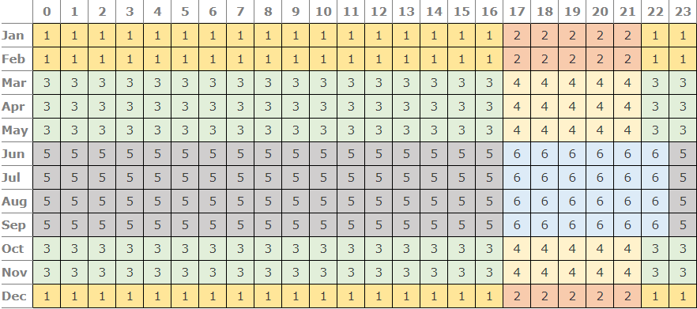
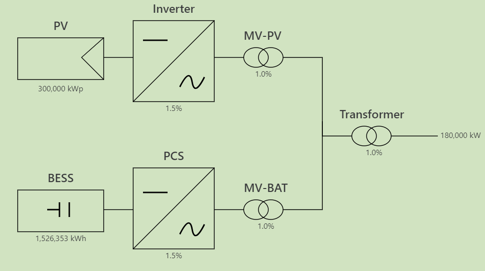
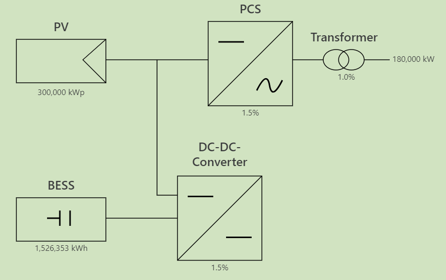

Usage
=====

Simulation
----------

You can simulate the enrgy flow of a photovoltaic system with energy storage using an OutputCalculator object. You can
recieve financial data and stats on a system after the simulation using a FinancialCalcualtor object.

Energy flow simulation
~~~~~~~~~~~~~~~~~~~~~~

To simulate a photovoltaic system with energy storage you need to create 2 objects: Producer and PowerStorage

You can create a producer using 3 options:

- using a file with hourly energy output of a year (see :code:'test.csv' file for an example)
- using pvgis api to recieve hourly data of a year
- using pvlib to calculate the hourly energy output of a year

Create a producer using file with:

.. literalinclude:: producer_file_example.py
    :language: python

- :code:`pv_output_file` is the name of the file
- :code:`pv_peak_power` is the rated power of the producer.

you can also specify the timezone of the system with parameter :code:`timezone` (defualt is Jerusalem timezone).

Create a producer using pvgis with:

.. literalinclude:: producer_pvgis_example.py
    :language: python

- :code:`latitude` and :code:`longitude` specify the location of the system
- :code:`tilt` is the angle of the modules from the ground
- :code:`azimuth` is the direction the module are facing (0 is south)
- :code:`tech` is the type of modules used in the system (:code:`FIXED`, :code:`TRACKER`, or :code:`EAST_WEST`)
- :code:`pv_peak_power` is the rated power of the producer.
- :code:`losses` is the overall PV system losses

Create a producer using pvlib with:

.. literalinclude:: producer_pvlib_example.py
    :language: python

- :code:`latitude` and :code:`longitude` specify the location of the system
- :code:`tilt` is the angle of the modules from the ground
- :code:`azimuth` is the direction the module are facing (0 is south)
- :code:`tech` is the type of modules used in the system (:code:`FIXED`, :code:`TRACKER`, or :code:`EAST_WEST`)
- :code:`modules_per_string` is the number of module in each electronic string
- :code:`strings_per_inverter` is the number of string connected to each inverter
- :code:`number_of_inverters` is the number of inverters in the PV system
- :code:`module` is a pandas series with parameters for the module
- :code:`inverter` is a pandas series with parameters for the inverter
- :code:`use_bifacial` is a boolean idicating if the system uses bifacial calculation
- :code:`albedo` is the fraction of sunlight diffusely reflected by the ground

Create a power storage with:

.. literalinclude:: power_storage_example.py
    :language: python

- :code:`num_of_year` is the number of years the storage system will be used
- :code:`grid_size` is the size of the connection to the grid (in kW)
- :code:`block_size` is the size of each block in the storage system
- :code:`battery_hours` is the number of hours the storage system should supply each day (used to determine the size of
  the system)
- :code:`use_default_aug` is a boolean idicating using a default augmentation configuration

The size of the system is determined by an augmentation table with the month each augmentation is installed and the 
number of blocks in each augmentation. When battery_hours is specified and use_default_aug is true we use 3
augmentations. The first augmentation is in the 0 month (system initial construction) with size that suffice for supplying
battery_hours times grid_size (with extra for losses), and adding about 20% after 8 and 16 years. If use_default_aug 
is false only uses te first augmentation.

Additional parameters:

- :code:`deg_table`, :code:`dod_table` and :code:`rte_table` are 3 listed of values between 0 and 1, specifying the
  degradation, depth of discharge and round trip efficiency for each year
- :code:`pcs_loss`, :code:`mvbat_loss` and :code:`trans_loss` are different losses in the system
- :code:`idle_self_consumption` and :code:`active_self_consumption` are the percentage of the nominal storage system
  (nameplate) the battery consumes in each hour for its operation (active for hours wher charging/discharge and idle
  for the rest of the hours)
- :code:`aug_table` is an option to specify the augmentation table directly

Using these objects, create and run an OutputCalculator with:

.. literalinclude:: simulation_example.py
    :language: python

:code:`monthly_averages` return a matrix with the average of the given stat (default total energy output) in each hour 
of the day for each month, in the given year range (default first year only). You can also use :code:`plot_stat` 
function with similar parameters to plot a stat.

Parameters:

- :code:`num_of_year` is the number of years the system will be used
- :code:`grid_size` is the size of the connection to the grid (in kW)
- :code:`producer` is a producer object
- :code:`power_storage` is a power_storage object
- :code:`coupling` is the type of coupling (AC/DC) used in the system (below are diagram of the 2 options)
- :code:`mvpv_loss`, :code:`trans_loss`, :code:`mvbat_loss`, :code:`pcs_loss` and :code:`dc_dc_loss` are the different
  system losses
- :code:`bess_discharge_hour` is the hour the system start to discharge the storage
- :code:`fill_battery_from_grid` is a boolean idicating if the battery is filled from the grid when the producer power
  is not sufficient to fill the battery
- :code:`save_all_results` is a boolean idicating saving all the data for all the simulation years (and also save
  additional stats needed for some of the financial calculations)
- :code:`producer_factor` is a number between 0 and 1 which the producer output is multiplied by

Financial calculations
~~~~~~~~~~~~~~~~~~~~~~

After creating an output calculator you can pass it to a financial calculator that has methods for calculating several 
financial stats and financial data:

.. literalinclude:: financial_example.py
    :language: python

The financial stats caluclated:

- :code:`irr` is the internal rate of return of the system
- :code:`npv` is the net present value of the system
- :code:`lcoe` is the levelized cost of energy of the system (energy produced and purchased)
- :code:`lcos` is the levelized cost of storage of the system
- :code:`lcoe no grid power` is lcoe of the power from PV only

parameters:

- :code:`output_calcualtor` is an OutputCalculator object
- :code:`land_size` is the size of land used for the system
- :code:`capex/opex` are the cost of the system separated into 5 categories: by land size, by PV size, by battery size,
  by the size of the connection to the battery and misc.
- :code:`usd_to_ils` is a convertion rate from us dollars to israeli new shekel
- :code:`interest_rate` is the market interest rate
- :code:`cpi` is the consumer price index
- :code:`battery_deg_cost` is the annual reduction of battery cost (in percentage)
- :code:`base_tariff` is the base tariff used to construct the tariff table
- :code:`low/high_winter/transition/summer_factor` are factors by which the the base tariff is multiplied to create the
  tariff table
- :code:`buy_from_grid_factor` is a factor by which to multiply a tariff to get the prices of buy power
- :code:`tariff_table` is an option to specify the tariff table directly

The tariff table is constructed according to the following table:

.. note::

    The current version is only suited for working with tariffs with similar structure to the table above

Diagrams of the system
~~~~~~~~~~~~~~~~~~~~~~

AC coupling:

DC coupling:

Optimization
------------

You can run an optimization on an example system with:

.. literalinclude:: optimization_example.py
    :language: python

The outputs of the optimizer run method are the parameters of the optimal result (augmentation table and PV size factor) 
and the optimal result (the irr of the system with these parameters).

Run an optimization on a custom system with:

.. literalinclude:: optimization_full_example.py
    :language: python

- :code:`financial_calculator` is a FinancialCalcualtor object
- :code:`use_memory` is a boolean idicating if the optimizer will use a memory dict to get result of repeating queries
  quickly
- :code:`max_aug_num` is the maximum number of augmentations the optimizer will try in a solution
- :code:`initial_aug_num` is the number of augmentation in the initial guess
- :code:`budget` is the number of simulation to use for optimization

Additional parameters for Nevergrad optimizer:

- :code:`max_no_change_steps` is the maximum number of optimization step with no change before stopping (if none, 
  does not use early stopping)
- :code:`min_change_size` is the minimum change between steps to consider as a change for early stopping
- :code:`verbosity` is print information from the optimization algorithm (0: None, 1: fitness values, 2: fitness
  values and recommendation)